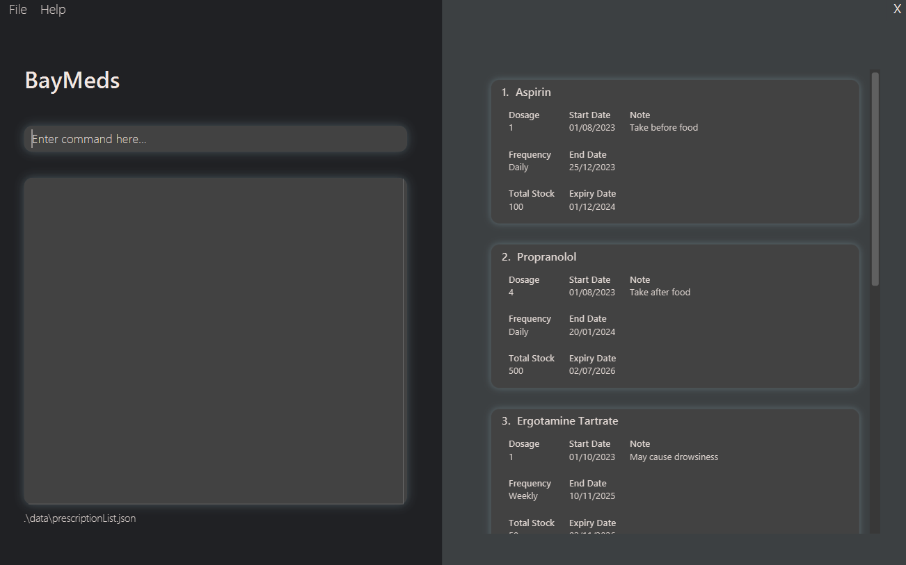
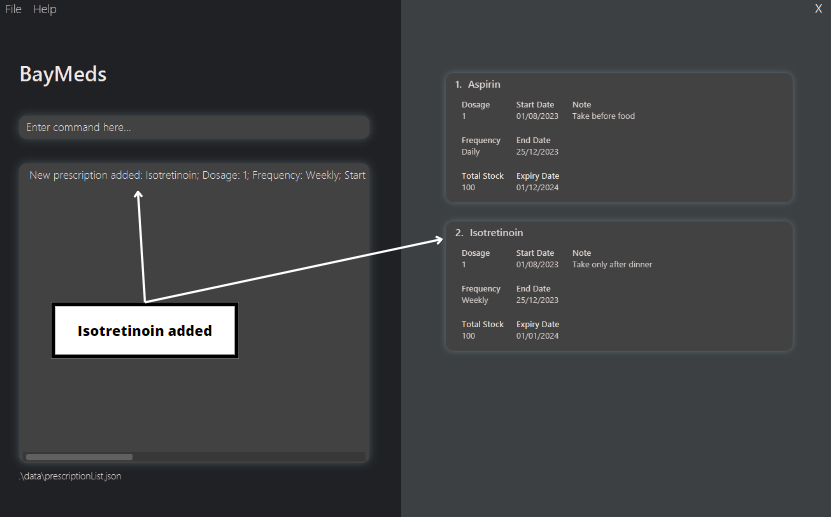
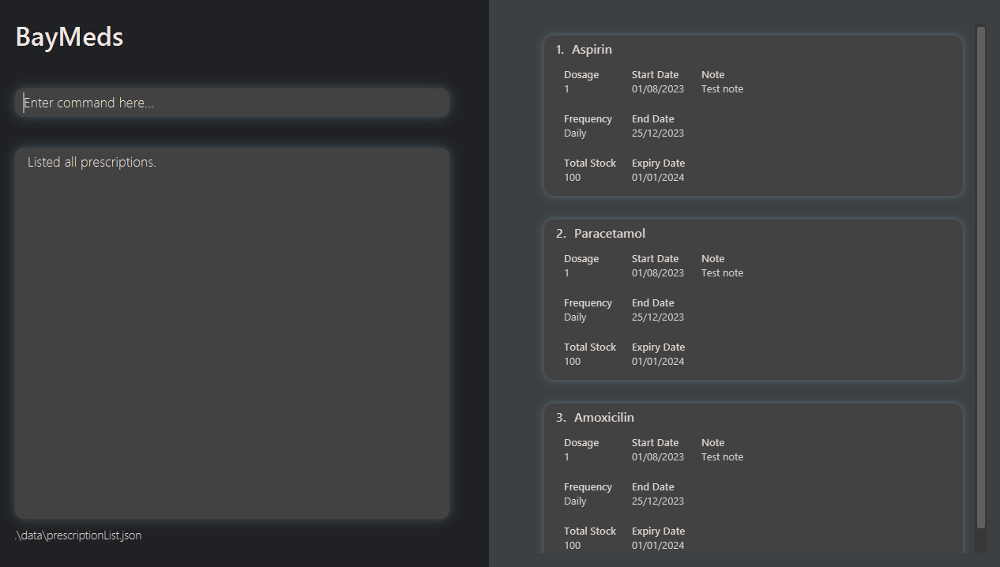
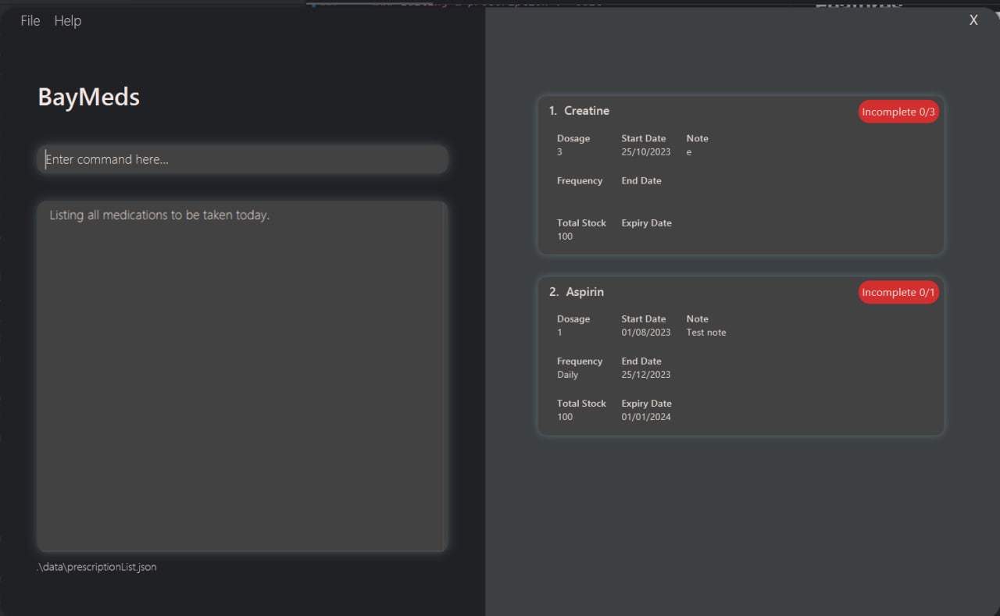
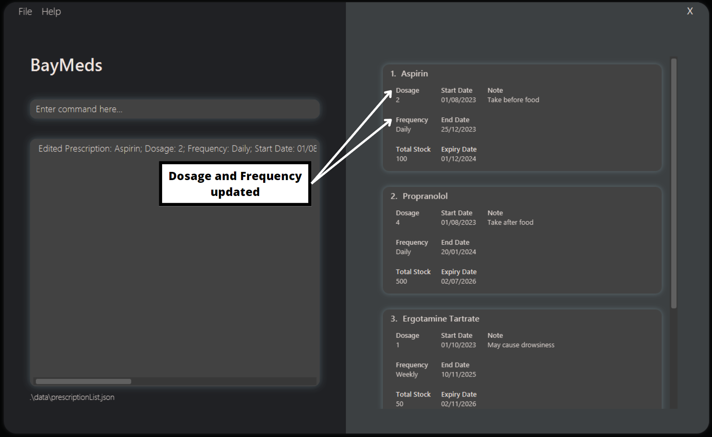
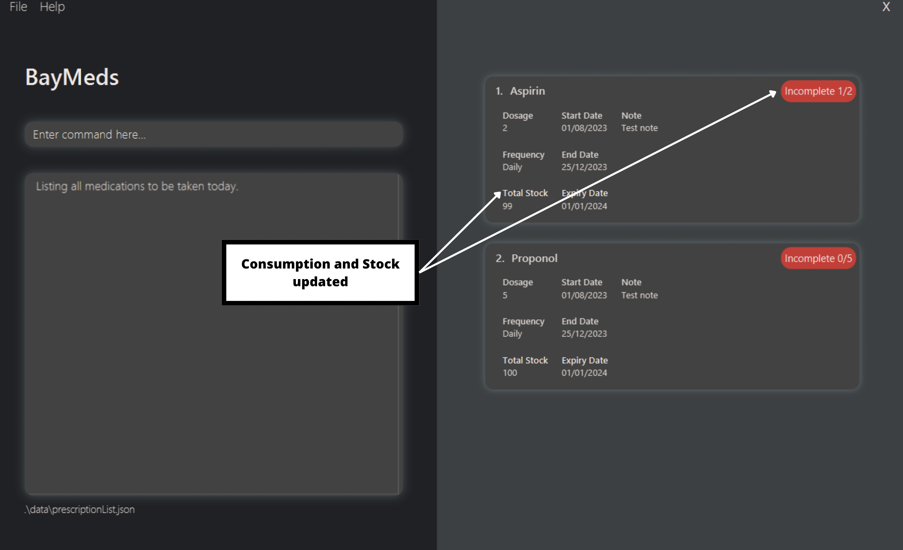
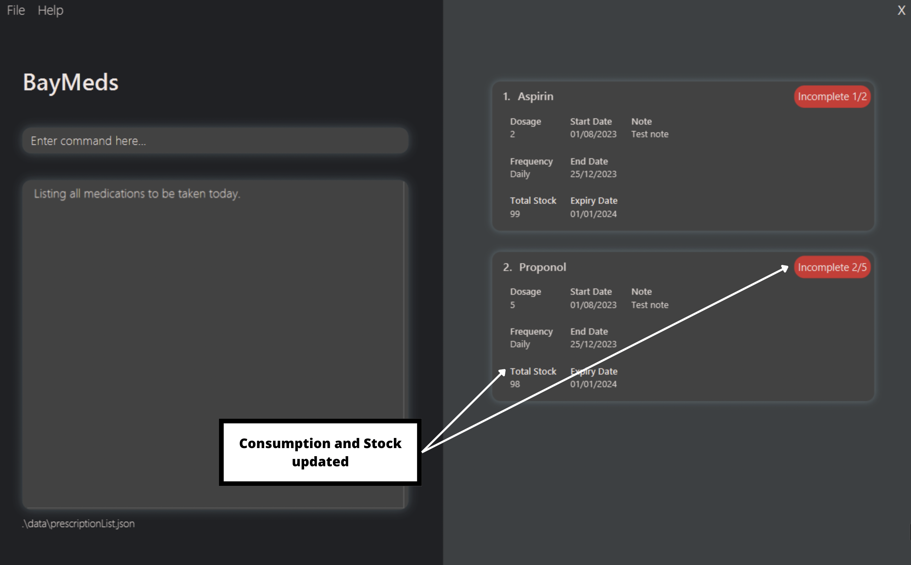
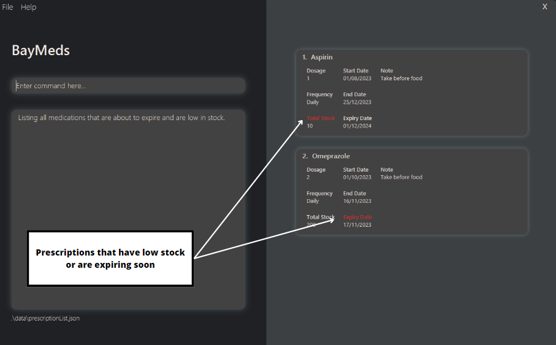

# BayMeds v.2103 User Guide

## Welcome to the BayMeds User Guide!

This guide provides a step-by-step documentation on how to use BayMeds' features and how to tackle commonly encountered errors. In addition, the [quick start guide](#quick-start) shows you how to get started in a matter of minutes!

### What is BayMeds?

BayMeds v.2103 (a.k.a BayMeds) is your go-to prescription management solution, catering to chronically ill patients or caregivers seeking a streamlined and effective way to track prescriptions. Ideal for those with busy lives and complex medication regimens, BayMeds offer reminders for staying on top of prescription schedules and provides a platform to track prescription consumptions. With a focus on user-friendliness, BayMeds aims to promote medication adherence and reduce misusage.

### What can I do with BayMeds?

#### Track consumption of existing prescriptions

BayMeds filters and shows you your prescriptions to be consumed each day. By marking prescriptions you have consumed, BayMeds will differentiate and show you the prescriptions that are completed and those that have yet to be completed for the day.

#### Store important details of existing prescriptions

BayMeds allows you to store details crucial to the consumption of the prescription, such as the end and expiry date of the prescription, as well as the current stock of pills available. You may also store specific requirements that a prescription may have, such as restricted consumption to only after heavy meals.

#### Get warnings for conflicting drugs

BayMeds informs you when you have drugs that conflicts with each other, e.g. drugs that react with other drugs or affect the efficacy of other drugs. This is especially useful for patients with multiple prescriptions, as it helps to prevent the consumption of conflicting drugs.

#### Track past prescriptions

BayMeds enables storage of past prescriptions, i.e. prescriptions that you have completed in the past. This provides ease of access to such information when required, such as during a Doctor's visit, or when checking how many pills of a particular prescription I took in the past I have left.

## Table of Contents
* <span style="color:red">**To be added.**</span>

### How to use this guide

Navigate to the Table of Contents anytime by clicking the button in the bottom right corner of your screen.

Also, here are some common icons you may encounter in this guide.

| Icon                      | Description            |
|---------------------------|------------------------|
| <box type="definition" /> | Examples               |
| <box type ="tip" />       | Useful tips            |
| <box type="info" />       | Additional information |
| <box type="warning" />    | Warning                |
| <box type="wrong" />      | Errors                 |

--------------------------------------------------------------------------------------------------------------------

## Quick start

<box type="tip">

If you are experienced in using JAR applications, simply download the latest version [here](https://github.com/AY2324S1-CS2103T-T15-2/tp/releases) and start the application.

</box>

1. Ensure you have Java `11` or above installed in your Computer.

1. Download the latest `BayMeds.jar` from [here](https://github.com/AY2324S1-CS2103T-T15-2/tp/releases).

1. Copy the file to the folder you want to use as the _home folder_ for BayMeds.

1. Open a command terminal, `cd` into the folder you put the jar file in, and use the `java -jar BayMeds.jar` command to start the application.<br>


   A GUI similar to the one below should appear in a few seconds. Note how the app contains some sample data.<br><br>
   

1. Type commands in the command box and press Enter to execute it. <br> e.g. typing the command **`help`** and pressing Enter will open the help window.<br>

   Some example commands you can try:

   * `list` : Shows all your prescriptions.

   * `add mn/Doxazosin f/Daily` : Adds a prescription `Doxazosin` to the list.

   * `delete 2` : Deletes the second prescription in the list.


1. Refer to the [features](#features) below for details of each command.

--------------------------------------------------------------------------------------------------------------------

## Features

<box type="info" header="**Notes about the command format**">

* Words in `<>` are parameters you can enter.
  <box type="definition" header="Example" seamless>

  For `add mn/<medication_name>`, `<medication_name>` is a parameter which can be used as `add mn/Aspirin`.
  </box>

* Items in `[]` are optional.
  <box type="definition" header="Example" seamless>

  `<medication_name> [sd/<start_date>]` can be used as `mn/Aspirin sd/25/10/2023` or as `mn/Aspirin`.
  </box>

* Parameters can be in any order.
  <box type="definition" header="Example" seamless>

  For `mn/<medication_name> f/<frequency>`, `f/<frequency> mn/<medication_name>` is also acceptable.
  </box>

* If you are using a PDF version of this document, be careful when copying and pasting commands that span multiple lines as space characters surrounding line-breaks may be omitted when copied over to the application.

</box>

### How to add a prescription : `add`

Upon getting a new prescription from the doctor, BayMeds allows you to add the prescription to the list.

To add the prescription, type the following command.

Format:
```
add
  mn/<medication_name>
  [d/<dosage>]
  [f/<frequency>]
  [sd/<start_date>]
  [ed/<end_date>]
  [exp/<expiry_date>]
  [ts/<total_stock>]
  [cfdg/<conflicting_drugs>]
  [n/<note>]
```

The prescription will then be added and shown in the list.

<box type="info" header="Notes">

* `<medication_name>` refers to the name of the medication.
  <box type="definition" header="Example" seamless>

  Aspirin, Doxazosin, Propranolol
  </box>

* `<dosage>` refers to the number of pills to be taken. It only accepts a numeric value.
  <box type="definition" header="Example" seamless>

  For 1 pill, type 1.
  </box>

* `<frequency>` refers to the interval to consume the prescription. It only accepts the inputs `Daily`, `Weekly` or `Monthly`.

* `<start_date>`, `<end_date>` and `<expiry_date>` should be in <span style="color:red">**dd/mm/yyyy format**</span>.
  <box type="definition" header="Example" seamless>

  For 20th Septemeber 2023, type `20/09/2023`.
  </box>

* `<total_stock>` refers to the total number of pills you have. It only accepts a numeric value.
  <box type="definition" header="Example" seamless>

  For 100 pills, type 100.
  </box>

* `<conflicting_drugs>` refers to the drugs that conflict with your prescription. It accepts space separated drug names.
  <box type="definition" header="Example" seamless>

  If your prescription has 2 conflicting drugs (Paracetamol and Aspirin), type Paracetamol Aspirin.
  </box>

* `<note>` refers to any important or special information you would like to include.
  <box type="definition" header="Example" seamless>

  "To be taken after meals".
  "Take after food".
  </box>

</box>

<box type="definition" header="#### Example 1">

```
add mn/Isotretinoin d/1 f/Weekly sd/01/08/2023 ed/25/12/2023 exd/01/01/2024 ts/100 n/Take only after dinner
```
By typing this command, you will add a new prescription with the following information.

* Medication name: Isotretinoin
* Dosage: 1
* Frequency: Weekly
* Start date: 01/08/2023
* End date: 25/12/2023
* Expiry date: 01/01/2024
* Total stock: 100
* Note: Take only after dinner

After successfully adding the prescription, you will get the following result: <br>



</box>

<box type="definition" header="#### Example 2">

```
add mn/Doxazosin
```
By typing this command, you will add a new prescription with the following information.
* Medication name: Doxazosin

After successfully adding the prescription, you will get the following result: <br>


<box type="info">

As shown in this example, the date of which this entry was entered (e.g. 27/10/2023) will be used as the default start date if no start date was given.
</box>

</box>

### How to list all current prescriptions : `list`

BayMeds allows you to list all prescriptions you are currently taking.

To list all current prescriptions, type the following command.

Format:
```
list
```

You will then be able to see the relevant prescriptions in your list.

<box type="info" header="Notes">

If you would like to only view prescriptions that you have to consume for the day, use [listToday](#how-to-list-todays-medications-listtoday) instead.

If you would like to view prescriptions that you have consumed in the past, use [listCompleted](#listing-completed-prescriptions-listcompleted) instead.

</box>

<box type="definition" header="#### Example">

If you have prescriptions in the list, you will get something similar to this.



</box>

### How to list today's prescriptions : `listToday`

BayMeds allows you to list all prescriptions that you need to consume for the day.

To list these prescriptions, type the following command.

Format:
```
listToday
```

You will then be able to see the relevant prescriptions in the list.
<box type="info" header="Notes">

* Only the medications to be taken on the current day will be shown.
* Medications to be taken are determined by their frequency and start dates.
* Medications that have been completed for the day will be shown as completed.
* Medications that have yet to be completed for the day will be shown as incomplete .
* Medications that do not have a frequency will be shown, and amount that has been consumed will be shown.

If you would like to prescriptions that you are currently taking, use [list](#how-to-list-all-current-prescriptions-list) instead.

If you would like to view prescriptions that you have consumed in the past, use [listCompleted](#listing-completed-prescriptions-listcompleted) instead.
</box>

<box type="definition" header="#### Example">

If you have prescriptions to take today, you will see something similar to this.




</box>

### How to list completed prescriptions : `listCompleted`

BayMeds allows you to list prescriptions that you have consumed in the past.

To list these prescriptions, type the following command.

Format:
```
listCompleted
```

You will then be able to see your completed prescriptions in the list.

<box type="info" header="Notes">

The list of prescriptions shown after using this command will **not** respond to other commands such as `add`, `edit`, `take` etc. This is because this list is meant to store your consumption history for record-keeping purposes.
<box type="info" header="Example" seamless>

If you use `edit` while the list of completed prescriptions is displayed, `edit` will function based on the most recently displayed list from either [list](#how-to-list-all-current-prescriptions-list) or [listToday](#how-to-list-todays-prescriptions-listtoday).
</box>

If you would like to prescriptions that you are currently taking, use [list](#how-to-list-all-current-prescriptions-list) instead.

If you would like to only view prescriptions that you have to consume for the day, use [listToday](#how-to-list-todays-medications-listtoday) instead.

</box>

<box type="definition" header="#### Example">

If you have completed prescriptions, you will see something similar to this.


</box>

### How to edit a prescription : `edit`

You may wish to update any of the fields of the prescription for a variety of reasons, such as a change in dosage, or an increase in stock. BayMeds allows you to edit such fields in the prescription.

To edit a prescription, type the following command.

Format:
```
edit
  <index>
  [mn/<medication_name>]
  [d/<dosage>]
  [f/<frequency>]
  [sd/<start_date>]
  [ed/<end_date>]
  [exd/<expiry_date>]
  [ts/<total_stock>]
  [n/<note>]
```

Based on fields you specify, the corresponding fields of the index-identified prescription will be updated with the new value. Fields that are not specified will continue to remain the same.

<box type="info" header="Notes">

* The `<index>` specifies the prescription to be edited.
  <box type="definition" header="Example" seamless>

    To edit the first prescription in the list (currently being displayed), specify the `<index>` as 1.
  </box>

* At least one of the optional fields must be provided.

* Input values cannot be empty.

* If the currently displayed list shows your completed prescriptions (i.e. prescriptions that you have consumed in the past), [edit](#how-to-edit-a-prescription-edit) will not update these prescriptions. Instead, it will update based on the most recently displayed list from either [list](#how-to-list-all-current-prescriptions-list) or [listToday](#how-to-list-todays-prescriptions-listtoday).

</box>

<box type="definition" header="#### Example 1">

```
edit 1 d/2 f/Daily
```

By typing this command, you will edit the dosage and frequency of the first prescription on the list (currently being displayed) to be `2` and `Daily` respectively.



</box>

<box type="definition" header="#### Example 2">

```
edit 2 mn/Creatine n/Red Pill
```

By typing this command, you will edit the name and note of the second prescription on the list (currently being displayed) to be `Creatine` and `Red Pill` respectively.

</box>

### How to find prescriptions by name : `find`

With a complex medication regime, BayMeds allows you to easily filter and find your prescriptions with names that contain the specified keyword.

Format:
```
find <keyword>...
```
<box type="info" header="Notes">

* The `...` indicates that you can include multiple `<keywords>`.
  <Box type="definition" header="Example" seamless>

  You can indicate `find Ketoconazole Shampoo`.
  </Box>

* The search is case-insensitive.
  <Box type="definition" header="Example" seamless>

  `find paracetamol` will also match `Paracetamol`.
  </Box>

* The order of the keywords does not matter.
  <Box type="definition" header="Example" seamless>

  `find Ketoconazole Shampoo` will match `Shampoo Ketoconazole`.
  </Box>

* Only the medication name is searched and matched.

* Substrings will be matched.
  <Box type="definition" header="Example" seamless>

  `find Para` will match `Paracetamol`.
  </Box>

* Prescriptions will be matched as long as any part of it matches the `<keyword>`.
  <Box type="definition" header="Example" seamless>

  `Ketorolac ophthalmic` will return both `Ketotifen ophthalmic` and `Ketorolac Tromethamine`.
  </Box>

</box>

<box type="definition" header="#### Example">

```
find Ketorolac ophthalmic
```
Displays `Ketotifen ophthalmic`, `Ketorolac Tromethamine`.<br>


</box>

### How to delete a prescription : `delete`

Should you need to remove your prescriptions, BayMeds allows you to **permanently** delete a specified prescription from the list (currently being displayed).

In order delete a prescription, type the following command.

Format:
```
delete <index>
```

This will cause the prescription at that index to be removed from the list (currently being displayed) and **permanently** deleted.

<box type="info" header="Notes">

* The `<index>` specifies the prescription to be deleted.
  <box type="definition" header="Example" seamless>

    To delete the first prescription in the list (currently being displayed), specify the `<index>` as 1.
  </box>

* If the currently displayed list shows your completed prescriptions (i.e. prescriptions that you have consumed in the past), [delete](#how-to-edit-a-prescription-edit) will not remove these prescriptions. Instead, it will delete based on the most recently displayed list from either [list](#how-to-list-all-current-prescriptions-list) or [listToday](#how-to-list-todays-prescriptions-listtoday).

</box>

<box type="definition" header="#### Example">

```
delete 3
```

By typing this command, you will delete the third prescription from the list (currently being displayed).


</box>

### How to take a medication : `take`

Upon consuming a medication, you may wish to indicate that you have taken 1 / 4 pills, or that you have completed your dosage for the day. BayMeds allows you to update prescriptions with the amount of dosage you have taken.

In order to do so, type the following command.

Format:
```
take
  <index>
  [d/<dosage>]
```

This will update the index-identified prescription with the specified amount of `<dosage>`.

<box type="info" header="Notes">

* The `<index>` specifies the prescription to be marked as taken.
  <box type="definition" header="Example" seamless>

    To update the first prescription in the list (currently being displayed), specify the `<index>` as 1.
  </box>

* `<dosage>` refers to the number of pills you have taken. It only accepts a numeric value.
  <box type="definition" header="Example" seamless>

  If you have taken 2 pills, specify the `<dosage>` as 2.
  </box>

* Since `<dosage>` is an optional input, it will be set as 1 if no input is given.

* The amount consumed will be increased by the specified `<dosage>`.

* The stock field of the prescription will be decreased by the specified `<dosage>`.

If you would like to see the updated consumption count and stock, use [listToday](#how-to-list-todays-medications-listtoday).

* If the currently displayed list shows your completed prescriptions (i.e. prescriptions that you have consumed in the past), [take](#how-to-take-a-medication-take) will not update these prescriptions. Instead, it will update based on the most recently displayed list from either [list](#how-to-list-all-current-prescriptions-list) or [listToday](#how-to-list-todays-prescriptions-listtoday).

</box>

<box type="definition" header="#### Example 1">

```
take 1
```
By typing this command, you will indicate that you have taken 1 dose from the first prescription.



As shown in this example, the dosage taken is set as 1 if dosage is not specified.
</box>

<box type="definition" header="#### Example 2">

```
take 2 d/2
```
By typing this command, you will take 2 doses from the second prescription.



</box>

### How to untake a medication : `untake`

If you have accidentally indicated that you have taken a medication, Baymeds allows you untake the medication similar to the [take](#how-to-take-a-medication-take) feature.

Note that this feature is meant to revert errors made by the user, updating changes to the stock and consumption count and does not indicate that the medication has actually been untaken.

In order to do so, type the following command.

Format:
```
untake
  <index>
  [d/<dosage>]
```

This will update the index-identified prescription with the specified amount of `<dosage>` to be removed.

<box type="info" header="Notes">

* The `<index>` specifies the prescription to be marked as taken.
  <box type="definition" header="Example" seamless>

    To update the first prescription in the list (currently being displayed), specify the `<index>` as 1.
  </box>

* `<dosage>` refers to the number of pills you want to mark as not consumed. It only accepts a numeric value.
  <box type="definition" header="Example" seamless>

  If you wish to mark 2 pills of the prescription as not consumed, specify the `<dosage>` as 2.
  </box>

* Since `<dosage>` is an optional input, it will be set as 1 if no input is given.

* The amount consumed will be decreased by the specified `<dosage>`.

* The stock field of the prescription will be increased by the specified `<dosage>`.

If you would like to see the updated consumption count and stock, use [listToday](#how-to-list-todays-medications-listtoday).

* If the currently displayed list shows your completed prescriptions (i.e. prescriptions that you have consumed in the past), [untake](#how-to-untake-a-medication-untake) will not update these prescriptions. Instead, it will update based on the most recently displayed list from either [list](#how-to-list-all-current-prescriptions-list) or [listToday](#how-to-list-todays-prescriptions-listtoday).

</box>

<box type="definition" header="#### Example 1">

```
untake 1
```
Typing this command will update 1 dose from the first prescription as not consumed.

Using the same prescription list as shown in [take](#how-to-take-a-medication-take), you will get the following result:


As shown in this example, the dosage to untake is set as 1 if not dosage is specified.
</box>

<box type="definition" header="#### Example 2">

```
untake 2 d/2
```
Typing this command will update 2 doses from the second prescription as not consumed.

Using the same prescription list as shown in [take](#how-to-take-a-medication--take), you will get the following result:


</box>

### How to list medications that are about to expire or low in stock : `reminder`

If you need to know which medications are near expiry or are low in stock, type the following command.

Format:
```
reminder
```

You will then be able to see medications that are near expiry or low in stock in the list.

<box type="info" header="Notes">

*  Medications that are expiring within the next 7 days will be shown.

*  Medications that either have less than 10 tabs left or have 7 dosages worth left will be shown.

</box>

<box type="definition" header="#### Example">

If you have prescriptions near expiry or low in stock, you will see something similar to this.



</box>

### How to list a prescription's conflicting drugs : `listConflicts`

As you can store drugs that conflict with the prescription, BayMeds allows you to view this list of conflicting drugs.

In order to view the drugs that conflict with a specific prescription, type the following command.

Format:
```
listConflicts <index>
```

You will then be able to see the conflicting drugs on the left side.

<box type="info" header="Notes">

* The `<index>` specifies the prescription to show.
  <box type="definition" header="Example" seamless>

    To show the conflicting drugs of the first prescription in the list (currently being displayed), specify the `<index>` as 1.
  </box>

* If the currently displayed list shows your completed prescriptions (i.e. prescriptions that you have consumed in the past), [listConflicts](#how-to-list-a-prescriptions-conflicting-drugs-listconflicts) will not follow this list. Instead, it will use the list based on the most recently displayed list from either [list](#how-to-list-all-current-prescriptions-list) or [listToday](#how-to-list-todays-prescriptions-listtoday).

</box>

<box type="definition" header="#### Example">

```
listConflicts 2
```

If you have conflicting drugs for the prescription at the index, you will see something similar to this.


</box>

### How to list all conflicting drugs : `listAllConflicts`

Should you need to see **all** the drugs that conflict with all your current prescriptions, BayMeds allows you to view all these drugs in a single list.

In order to list **all** conflicting drugs, type the following command.

Format:
```
listAllConflicts
```

You will then be able to see all conflicting drugs on the left side.

<box type="definition" header="#### Example">

```
listAllConflicts
```

If you have conflicting drugs for the current prescriptions, you will see something similar to this.


</box>

### How to view help : `help`

If you need more information about how to use BayMeds, BayMeds allows you to view our [User Guide](#welcome-to-the-baymeds-user-guide).

To open the help window, type the following command.

Format:
```
help
```

You will then see a help window with the link to our User Guide pop up.

### How to exit BayMeds : `exit`

In order to exit BayMeds, type the following command.

Format:
```
exit
```

### Saving the data

BayMeds data are saved in the hard disk automatically after any command that changes the data. There is no need to save manually.

### Editing the data file

BayMeds data are saved automatically as a JSON file `[JAR file location]/data/prescriptionList.json and completedPrescriptionList.json`. Advanced users are welcome to update data directly by editing that data file.

<box type="warning" seamless>

**Caution:**
If your changes to the data file makes its format invalid, BayMeds will discard all data and start with an empty data file at the next run.  Hence, it is recommended to take a backup of the file before editing it.
</box>

--------------------------------------------------------------------------------------------------------------------

## FAQ

**Q**: How do I store the size and colour of the pill?<br>
**A**: Add it as a note when adding the prescription.<br>

**Q**: How do I know if I have taken the medication for the day?<br>
**A**: Use `listToday` command to list out all medications to be taken for the day.
Medication with a green label have been taken while those with a red label have yet to be taken.<br>

**Q**: Is my data shared with other software or organisations?<br>
**A**: Data is stored locally in the computer and is not stored in any external database nor shared with other third parties.
We recommend locking your device before leaving it unattended to prevent others from accessing your prescription records and consumption history.<br>

**Q**: How do I transfer my data to another Computer?<br>
**A**: Install the app in the other computer and overwrite the empty data file it creates with the file that contains the data of your previous BayMeds home folder.<br>

**Q**: What if I eat extra medication by accident?<br>
**A**: The application allows you to take extra dosages even if it differs from the intended frequency and dosage.
This allows you to correctly and effectively track dosages that you may have mistakenly taken.<br>

**Q**: Can I manually reset the completion status of a medication?<br>
**A**: No, the completion status of a medication is automatically reset upon the beginning of a new day.
If you have wrongly inputted the taking of a medication, use the [untake](#how-to-untake-a-medication--untake) command.<br>

**Q**: What happens if my drug has no valid details but I take it?<br>
**A**: You will still be allowed to take the drug, allowing you to keep track of the drugs that you have taken.<br>


--------------------------------------------------------------------------------------------------------------------

## Known issues

1. **When using multiple screens**, if you move the application to a secondary screen, and later switch to using only the primary screen, the GUI will open off-screen. The remedy is to delete the `preferences.json` file created by the application before running the application again.

--------------------------------------------------------------------------------------------------------------------

## Command summary

| Action                   | Format, Example                                                                                                                                                                                                                                                 |
|--------------------------|-----------------------------------------------------------------------------------------------------------------------------------------------------------------------------------------------------------------------------------------------------------------|
| **Add**                  | `add mn/<medication_name> [d/<dosage>] [f/<frequency>]  [sd/<start_date>] [ed/<end_date>] [exd/<expiry_date>] [ts/<total_stock>] [n/<note>]`, <br> e.g. `add mn/Aspirin d/1 f/Daily sd/20/09/2023 ed/03/10/2024 exp/04/10/2024 ts/100 n/Take during meals`      |
| **Delete**               | `delete <index>`, <br> e.g. `delete 2`                                                                                                                                                                                                                          |
| **Mark**                 | `take <index> [d/<dosage_taken>]`, <br> e.g. `take 1 d/1`                                                                                                                                                                                                       |
| **List**                 | `list`                                                                                                                                                                                                                                                          |
| **List today**           | `listToday`                                                                                                                                                                                                                                                     |
| **List completed**       | `listCompleted`                                                                                                                                                                                                                                                 |
| **Find**                 | `find <keyword>`, <br> e.g. `find Aspirin`                                                                                                                                                                                                                      |
| **Reminder**             | `reminder`                                                                                                                                                                                                                                                      |
| **List conflicts**       | `listConflicts`                                                                                                                                                                                                                                                 |
| **List all conflicts**   | `listAllConflicts`                                                                                                                                                                                                                                              |
| **Help**                 | `help`                                                                                                                                                                                                                                                          |
| **Exit**                 | `exit`                                                                                                                                                                                                                                                          |
